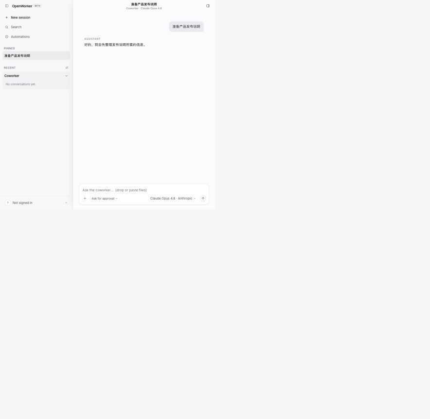
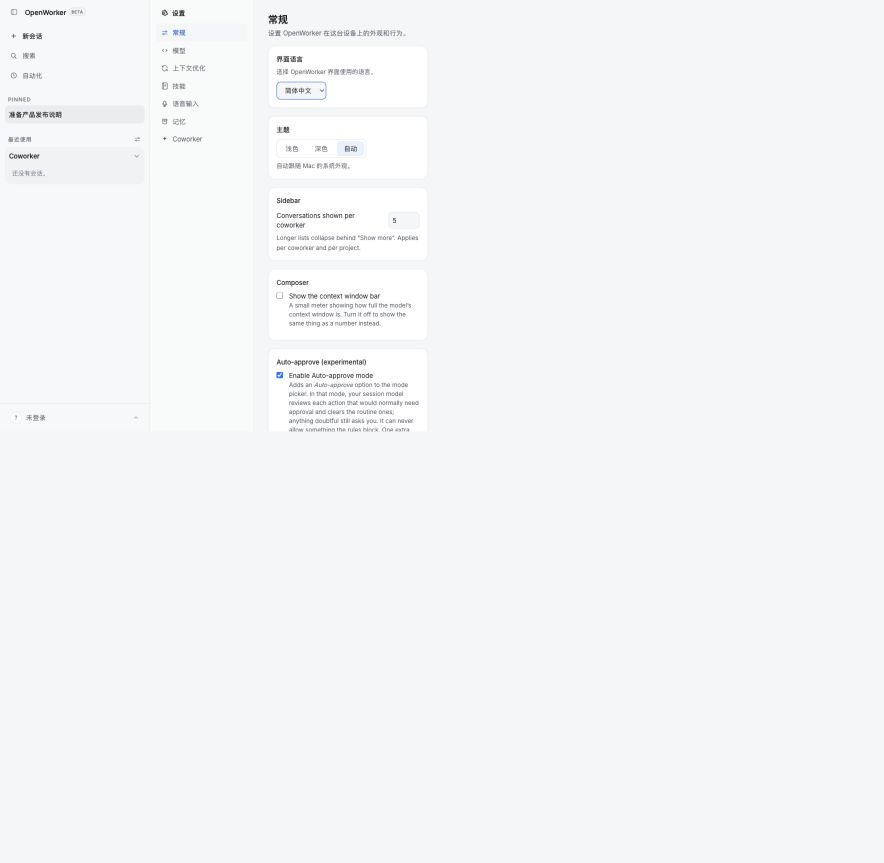
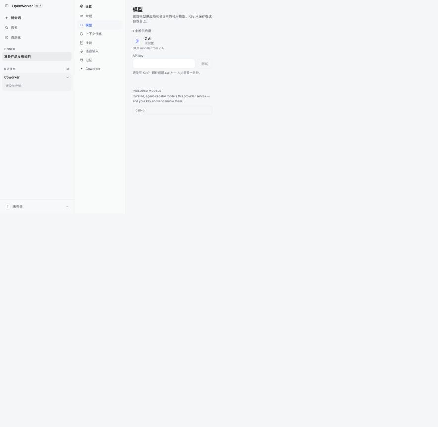

# OpenWorker

**[openworker.com](https://openworker.com)** · [Download](#download) · [Issues](https://github.com/andrewyng/openworker/issues)

<a href="https://trendshift.io/repositories/91434?utm_source=trendshift-badge&amp;utm_medium=badge&amp;utm_campaign=badge-trendshift-91434" target="_blank" rel="noopener noreferrer"></a>

> **Beta** - OpenWorker is in open beta: fully usable, updates itself, and we're actively polishing rough edges. [Issues](https://github.com/andrewyng/openworker/issues) welcome.

## 社区简体中文汉化版

这是基于上游 OpenWorker 的社区 Fork，提供 English / 简体中文界面切换。它不是官方中文版，汉化工作正在持续完善中。

- Fork：<https://github.com/cr-yijieshusheng/openworker>
- 汉化分支：`i18n-simplified-chinese`
- 上游合并申请：<https://github.com/andrewyng/openworker/pull/542>
- 最新版本：<https://github.com/cr-yijieshusheng/openworker/releases/tag/v0.2.1-zh.4>
- 维护说明（自动跟版 / 自动更新）：[docs/FORK-MAINTENANCE.md](docs/FORK-MAINTENANCE.md)

当前已覆盖常用会话、设置、模型供应商、导航、模型选择和部分连接器文案。少量高级功能、连接器详情和开发者文案仍可能显示英文；遇到问题请在 Fork 仓库提交 Issue，并注明系统、版本和复现步骤。







### 使用汉化版

1. 在 Fork 的 [Releases](https://github.com/cr-yijieshusheng/openworker/releases) 下载安装包（不要用下方官方 `download.openworker.com` 链接），或切换到 `i18n-simplified-chinese` 从源码运行。
2. 启动后打开 `设置 → 常规 → 界面语言`，选择 `简体中文`。
3. 在 `设置 → 模型` 中配置自己的模型供应商和 API Key。Key 只保存在本机，不要在 Issue、截图或 README 中公开。

自 `v0.2.1-zh.4` 起，桌面版会检查**本 Fork** 的 Releases 并提示更新（需发布时配置了签名密钥，见 [FORK-MAINTENANCE.md](docs/FORK-MAINTENANCE.md)）。上游新版本由 GitHub Actions **Sync upstream** 自动合并汉化分支并打 `v*-zh.N` 包；若你仍在用更早的手动包，请先手动装一次新版。

**AI that gets your everyday tasks done.** OpenWorker is an open-source AI coworker that lives on your desktop and delivers **finished work**, not just chat: a polished document, a Slack reply with the numbers, an updated calendar, a triaged inbox.

It runs on your machine and doesn't lock you into any model: bring your own API key for OpenAI, Anthropic, Google, or an open-weight provider, or run fully local with Ollama. Your data leaves your machine only through the model and integrations *you* choose.

[](https://openworker.com)

## Download

[**⬇ macOS (Apple Silicon)**](https://download.openworker.com/mac)
<sub>macOS 12+ · signed & notarized · auto-updates</sub>

[**⬇ Windows 10/11 (x64)**](https://download.openworker.com/windows)
<sub>builds are not yet code-signed, so SmartScreen will warn; signing is in progress</sub>

Open the app, add a model key (or point it at Ollama), and ask for something real.

## How it works

1. Tell OpenWorker the outcome you want - "prepare a customer brief," "untangle my calendar," "draft a report," "check where the release stands across Jira and GitHub."
2. It breaks the task into steps and works across your desktop, files, and connected apps.
3. Before anything consequential - sending a message, changing a calendar, running a command - it checks in and you approve or redirect.
4. You get the finished deliverable, not a to-do list.

Under the hood:

```text
┌────────────────────────────────────────────────┐
│              OpenWorker desktop app            │  native shell + GUI
├────────────────────────────────────────────────┤
│           local agent server (Python)          │  engine · tools · connectors - built on aisuite
├───────────────┬────────────────┬───────────────┤
│  your files   │   your tools   │  your model   │  everything runs with your keys,
│  & terminal   │ 25+ connectors │  any provider │  on your machine
└───────────────┴────────────────┴───────────────┘
```

## What it can do

- **Produce real deliverables** - documents, spreadsheets, reports, and web pages land as files you can open and share.
- **Work from Slack** - mention `@OpenWorker` in a channel; a session opens on your desktop, the work happens with your tools, and the answer comes back as a thread reply.
- **Use your everyday tools** - 25+ integrations including GitHub, Slack, Jira, Notion, Linear, HubSpot, Outlook, monday.com, Gmail, and Google Calendar, plus your **terminal and local files**. Any tool reachable over [MCP](https://modelcontextprotocol.io/) plugs in too, with per-tool control.
- **Run on a schedule** - automations for recurring work: a morning brief, a weekly report, a standing watch over a channel. Runs land in the app with full transcripts.
- **Ask before acting** - writes, sends, and shell commands are approval-gated. Unattended runs park their asks in an inbox instead of acting on their own.

## Bring your own model

Model access is yours: pick a provider, paste your key, switch anytime. Supported out of the box:

**OpenAI · Anthropic · Google Gemini · BytePlus Ark · Volcengine Ark Agent Plan · Inkling (Thinking Machines) · GLM (Z.ai) · DeepSeek · Kimi (Moonshot) · Qwen · MiniMax · Mistral · Grok (xAI)** - plus open-weight models via **Together** and **Fireworks**, and fully local models via **Ollama**.

A curated model list marks what we've verified for tool-calling work. Adding any model string works at your own risk.

## Privacy

OpenWorker is local-first. Everything lives on your machine: the agent loop, your conversations, connector tokens, and model keys - all in the app's local secret store. The only cloud piece is a small service that brokers OAuth handshakes for connectors. You can always use the App without signing-in - use the connectors via manually-created credentials/API-keys.

## Run from source

Prerequisites: Python 3.10+, Node 20+, and (for the desktop shell) the Rust toolchain via [rustup](https://rustup.rs/).

```shell
git clone https://github.com/andrewyng/openworker
cd openworker

# 1. One-time bootstrap - creates the Python venv at .venv
#    (on Windows, run from Git Bash or WSL)
bash packaging/setup_dev_env.sh

# 2. Start the local agent server
.venv/bin/openworker-server --cwd ~/some/project --port 8765
#    (Windows: .venv\Scripts\openworker-server.exe)

# 3. In a second terminal, start the UI
cd surfaces/gui
npm install
npm run dev        # browser UI on the Vite dev port
```

The standalone server creates a per-launch token at
`<state-dir>/sidecar-8765.token`; Vite reads that user-only file when it starts.
For direct API calls, send its value in the `X-OpenWorker-Token` header. The
desktop app uses an in-memory launch token instead and never writes it to disk.

To run the full desktop app instead of the browser UI, replace step 3 with `npm run tauri dev` (from `surfaces/gui/`) - the Tauri shell launches the window and supervises the server itself.

Tests: `.venv/bin/pytest` (server), `npm test` and `npm run e2e` in `surfaces/gui` (GUI unit + hermetic end-to-end). Desktop bundles are built with `packaging/build_dmg.sh` / `packaging/build_windows.ps1`.

## Repository layout

| Directory | What's in it |
|---|---|
| `coworker/` | Python backend - agent engine, model providers, connectors, MCP client, memory, automations |
| `surfaces/gui/` | Desktop app - React UI + Tauri shell that supervises the server |
| `stt/` | Speech-to-text sidecar (Rust) for voice input |
| `packaging/` | Installer builds (macOS DMG, Windows), auto-update manifest, dev bootstrap |
| `docs/` | Design specs and decision logs |
| `tests/` | Backend test suite |

## Built on aisuite

OpenWorker's engine is built on [**aisuite**](https://github.com/andrewyng/aisuite), a lightweight Python library providing a unified chat-completions API across LLM providers and an agents layer with tools, toolkits, and MCP support. If you want to build your own agent harness rather than use ours, start there; this repo is a working reference for what aisuite can carry.

OpenWorker was originally developed inside the aisuite repository before moving to its own home here; thanks to the aisuite contributors whose work it builds on.

## Contributing

Contributions and bug reports are welcome - open an [issue](https://github.com/andrewyng/openworker/issues) or a pull request. The app updates itself, so fixes reach installs quickly.
For any PR, please attach screenshots of what was broken and how it is fixed now. We will shortly add features that you can contribute to.
Please note that we are actively developing based off a internal list and goal, so we may not approve PRs that add features that are already under-development or deviates from our vision.

## License

MIT - see [LICENSE](LICENSE).
